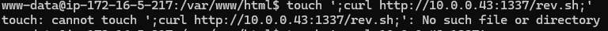
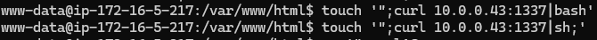

# LittleServer

  
   
  <i>Simple way to bypass bash command injection</i>i

## Introduction

Have you ever come across a privilege escalation situation involving wildcards for tar, or even cronjobs running scripts whose objective is to perform backups, listing the contents of a given directory?

  
   
  For this reason, I created this simple script that allows a certain file to be inserted alone into python's http.server, allowing, in command injection, the curl and wget commands to execute the shell normally.

 

## Usage
 

Nothing special to execute, just select your file and tcp port
 

`python3 lilserver.py <shell_file> <port_to_listen>`

  
   

